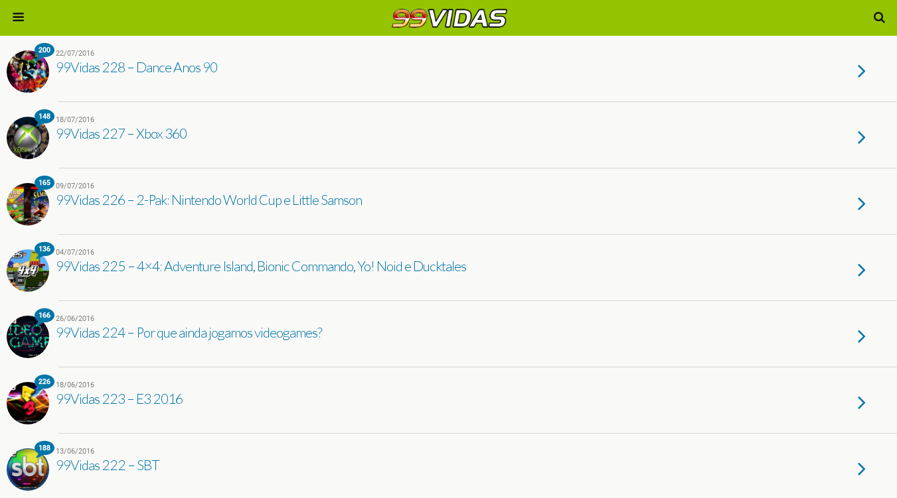

#  [99Vidas](http://99vidas.com.br) Lite

Uma extensão que faz o browser usar sempre a versão web mobile do [99Vidas](http://99vidas.com.br), que é muito mais rápido e com melhor aparência do que a versão desktop web. Quando você abre um link que normalmente seria para a interface desktop do [99Vidas](http://99vidas.com.br), esta extensão redireciona para a versão web mobile e faz com que seja mais clean.

## Exemplo

## Instalação

Clonar ou fazer o [download](https://github.com/brenopolanski/99vidas-lite/archive/master.zip) do projeto.

###### Chrome

1. Navevar para `chrome://extensions`;

2. Clicar em `Load unpacked extension...`;

3. Selecionar a pasta `extension`.

###### Firefox

1. Navevar para `about:debugging`;

2. Clicar em `Load temporary Add-on`;

3. Selecionar o arquivo `manifest.json` dentro da pasta `extension`.

###### Opera

1. Navevar para `extensions`;

2. Clicar em `Developer Mode`;

3. Clicar em `Load unpacked extension...`;

4. Selecionar a pasta `extension`.

## Teclas de atalho

- Ir para pesquisa: <kbd>/</kbd>
- Carregar mais casts: <kbd>space</kbd>
- Botão play/pause do player: <kbd>p</kbd>
- Botão mute do player: <kbd>m</kbd>
- Ir para página [principal](http://99vidas.com.br/): <kbd>g</kbd> <kbd>h</kbd>
- Ir para página [2-pak](http://99vidas.com.br/tag/2-pak/): <kbd>g</kbd> <kbd>2</kbd>
- Ir para página [4x4](http://99vidas.com.br/tag/4x4/): <kbd>g</kbd> <kbd>4</kbd>
- Ir para página [estilo 99vidas](http://99vidas.com.br/tag/estilo-99vidas/): <kbd>g</kbd> <kbd>9</kbd>
- Ir para página [História dos Videogames](http://99vidas.com.br/tag/historia-dos-videogames/): <kbd>g</kbd> <kbd>v</kbd>
- Ir para página [Pancadão](http://99vidas.com.br/tag/pancadao/): <kbd>g</kbd> <kbd>p</kbd>
- Scroll para o topo: <kbd>g</kbd> <kbd>g</kbd>
- Scroll para baixo: <kbd>G</kbd>

## Contribuindo

1. Dê um Fork no projeto!
2. Crie uma nova branch: `git checkout -b my-new-feature`
3. Comite suas alterações: `git commit -am 'Add some feature'`
4. Envie as alterações para a sua brach: `git push origin my-new-feature`
5. Submeta um Pull Request :)

## Referências

- [Chrome Web Request](https://developer.chrome.com/extensions/webRequest)
- [How to Access Mobile Websites Using Your Desktop Browser](http://www.howtogeek.com/139136/how-to-access-mobile-websites-using-your-desktop-browser/)
- [Browser detection using the user agent](https://developer.mozilla.org/en-US/docs/Browser_detection_using_the_user_agent)
- [Mousetrap](https://github.com/ccampbell/mousetrap)

## Licença

[MIT License](http://brenopolanski.mit-license.org/) © Breno Polanski
