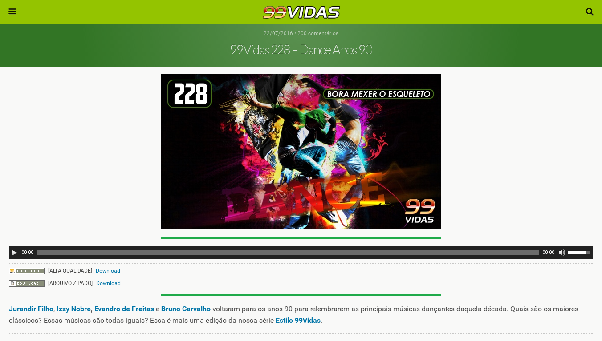

#  99Vidas Lite

## Exemplo

## Instalação

###### Chrome

1. Clone ou faça o [download](https://github.com/brenopolanski/99vidas-lite/archive/master.zip) do projeto;

2. Navevar até `chrome://extensions`;

3. Clicar em `Load unpacked extension...`;

4. Selecionar a pasta `extension`.

###### Firefox

*Em breve*

## Atalhos do teclado

- Ir para pesquisa: <kbd>/</kbd>
- Carregar mais casts: <kbd>space</kbd>
- Botão play/pause do player: <kbd>p</kbd>
- Botão mute do player: <kbd>m</kbd>
- Ir para página principal: <kbd>g</kbd> <kbd>h</kbd>
- Ir para página 2-pak: <kbd>g</kbd> <kbd>2</kbd>
- Ir para página 4x4: <kbd>g</kbd> <kbd>4</kbd>
- Ir para página estilo 99vidas: <kbd>g</kbd> <kbd>9</kbd>
- Ir para página História dos Videogames: <kbd>g</kbd> <kbd>v</kbd>
- Ir para página Pancadão: <kbd>g</kbd> <kbd>p</kbd>
- Scroll para o topo: <kbd>g</kbd> <kbd>g</kbd>
- Scroll para baixo: <kbd>G</kbd>

## Contribuindo

1. Dê um Fork no projeto!
2. Crie uma nova branch: `git checkout -b my-new-feature`
3. Comite suas alterações: `git commit -am 'Add some feature'`
4. Envie as alterações para a sua brach: `git push origin my-new-feature`
5. Submeta um Pull Request :)

## Referências

- [Chrome Web Request](https://developer.chrome.com/extensions/webRequest)
- [How to Access Mobile Websites Using Your Desktop Browser](http://www.howtogeek.com/139136/how-to-access-mobile-websites-using-your-desktop-browser/)
- [Browser detection using the user agent](https://developer.mozilla.org/en-US/docs/Browser_detection_using_the_user_agent)
- [Mousetrap](https://github.com/ccampbell/mousetrap)

## Licença

[MIT License](http://brenopolanski.mit-license.org/) © Breno Polanski
